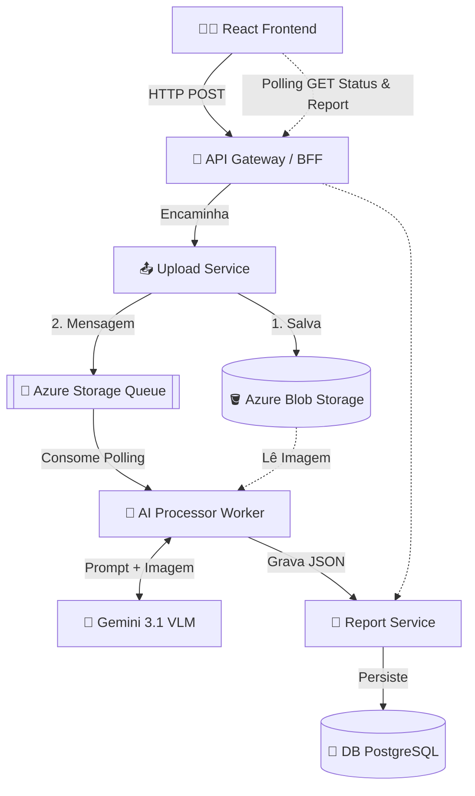

# FIAP Secure Systems: Architecture AI Analyzer 🚀


---
### 📺 [Vídeo Demonstrativo](https://youtu.be/iRFrgzph0d8)
---

## 📌 1. O Problema
Empresas que operam sistemas distribuídos possuem dezenas de diagramas de arquitetura, muitas vezes analisados visualmente e manualmente em busca de vulnerabilidades, pontos únicos de falha e boas práticas. Esse processo **não escala**, demanda muito tempo de especialistas caros (Arquitetos/Staff Engineers) e é propenso a falhas humanas. 

Para resolver isso, construímos o **FIAP Secure Systems AI Analyzer**, uma ferramenta que aplica IA Multimodal (Visão + Linguagem) para processar diagramas de arquitetura em segundos, emitindo pareceres técnicos estruturados sobre Componentes, Riscos e Recomendações.

---

## 🏛️ 2. Arquitetura Proposta e Fluxo da Solução

O sistema foi desenhado aplicando **Arquitetura Baseada em Microsserviços** (Clean Architecture/Hexagonal em cada serviço) com um fluxo altamente desacoplado e **Assíncrono**.

### Diagrama de Arquitetura (O Nosso Sistema)



### Fluxo da Solução
1. **Upload**: O cliente acessa a interface React e envia um diagrama (PNG, JPG, PDF).
2. **Ingestão**: O `API Gateway` recebe e joga para o `Upload Service`.
3. **Assincronismo**: O Upload Service salva o arquivo no `Blob Storage`, posta um evento na `Fila (Queue)` e devolve um Status HTTP 202 (Accepted). 
4. **Processamento (IADT)**: O `AI Processor` consome a fila e processa os documentos sob os status transicionais `PROCESSANDO`, `ANALISADO`, `AGUARDANDO_REVISAO_HUMANA` ou `ERRO`.
5. **Persistência**: O JSON estruturado do modelo é enviado ao `Report Service` e gravado num banco de dados isolado.
6. **Frontend Updates**: O frontend reativo (agora com um workspace provido de 4 novas abas: `Relatório Visual`, `Status de Processamento`, `Raw JSON`, e `Log de Processamento`) roda um *Polling* ao longo dos status de processamento até obter o JSON final.

### Fluxo de Orquestração de Agentes IA (Multi-Agent)
Nosso sistema de IA realiza a análise passando por agentes especializados garantindo extrema segurança, resiliência e ausência de alucinações ("Hallucination"):

1. **Input Guardrail**: Avalia preventivamente a imagem e metadata em busca de Prompt Injections ou textos maliciosos embutidos.
2. **Agente 1 (Reasoning / Extrator Visual)**: Exclusivo para extração literal. Um modelo multimodal (Visão) mapeia detalhadamente bancos de dados, conexões e componentes existentes na imagem, sem conclusões hipotéticas.
3. **Agente 2 (Redator / Estruturador JSON)**: Recebe os fatos do Agente 1 e atua como formatador e classificador técnico, emitindo recomendações de arquitetura e convertendo o output estritamente sob as raízes de nosso schema JSON.
4. **Validador (Pydantic)**: Atua junto ao agente gerador como middleware restritivo garantindo o parse do output à modelagem exata do negócio (`TechnicalReport`).
5. **LLM-as-a-Judge & Human-in-the-loop (HITL)**: Um juiz autônomo põe lado-a-lado a saída final e a imagem original. Se o juiz detectar componentes "inventados" ou omitidos, ele pune o *Confidence Score* do relatório. Se o erro for **crítico e severo**, ele aborta o processamento autônomo, suspende a resposta para o frontend e direciona o fluxo para a fila de **AGUARDANDO_REVISAO_HUMANA**, acionando o Arquiteto de Software pelo console de governança.

---

## 🚀 3. Instruções de Execução

Requisitos: Docker e Docker Compose instalados.

1. Clone o repositório.
2. Crie na raiz um arquivo `.env` e defina `GEMINI_API_KEY=sua_chave`.
3. Suba os containers locais:
```bash
docker compose up --build -d
```
4. Acesse:
   - **Frontend**: `http://localhost:5173` (Se rodar via Vite localmente: `cd frontend && npm run dev`)
   - **API Gateway**: `http://localhost:8000/docs`
   - **Métricas Prometheus**: `http://localhost:9090`

*(Para o deploy Cloud-Native na Azure, configuramos um GitHub Actions workflow base no diretório .github/workflows/deploy.yml provisionando infraestrutura moderna Serverless usando Azure Container Apps via Bicep).*

---

## 🛡️ 4. Segurança

Aplicamos rigorosas práticas defensivas tanto a nível de arquitetura quanto na IA:

1. **Estratégias de Validação e Tratamento de Entradas:**
   - **Frontend & Backend**: Restrição rígida de MIME Types (aceitando estritamente imagens e PDF).
   - Bloqueio de injeção de payload em metadados. Limite de tamanho de arquivo.

2. **Uso Controlado de Modelos de IA (Guardrails e Limites):**
   - Utilizamos *Prompt Engineering* fortemente tipado (forçando resposta restrita ou diretivas explícitas) limitando as saídas e escopo do LLM estritamente à análise arquitetural técnica.
   - **Mitigação de Alucinação (Hallucination)**: Configuramos *Zero Temperature (T=0.1)* para as chamadas da IA limitando a criatividade e aumentando o determinismo focado na topologia da imagem.

3. **Tratamento Seguro, Fallback e Human-in-the-Loop (Resiliência):**
   - Possuímos uma estratégia agressiva para instabilidades: Utilizamos Backoff em Retries. Se as cotas (HTTP 429) ou indisponibilidades persistirem, o sistema faz o **Fallback rebaixando a versão do modelo** `gemini-3.1-flash-lite` graciosamente para o `gemini-2.5-flash-lite`.
   - Se a etapa validatória (`LLM-as-a-Judge`) suspeitar categoricamente de falha e de uma quebra de governança (alucinação severa), embutimos um padrão de **Human-in-the-loop (HITL)** para não gerar laudos corrompidos nem mascarados: o processo assume o status `AGUARDANDO_REVISAO_HUMANA`, notifica no frontend, e desloca a payload para fila de revisão técnica aguardando o override manual da Engenharia.

4. **Isolamento e Práticas na Comunicação:**
   - **Segurança de Rede**: Serviços internos não possuem portas expostas diretamente para a internet. Só recebem comunicação via rede privada Docker/Kubernetes.
   - Apenas o `API Gateway` está exposto para recebimento das chamadas (atuando como Edge router).

5. **Riscos e Limitações Catalogados:**
   - *Limitação do VLM (Vision Model)*: Em diagramas extremamente densos ou com fontes muito pequenas, a IA pode omitir um microsserviço ou sub-rede.
   - *Risco de Context Window*: O modelo possui um cap; topologias de altíssima escala corporativa terão recomendada a subdivisão do diagrama antes do envio.

---

## 🔬 5. Testes Automatizados e End-to-End (E2E)

Atendendo aos requisitos de qualidade e Clean Architecture, o projeto possui testes automatizados unitários, de integração e End-to-End.

Para executar os testes locais (utilizando Pytest ou diretamente no Python):
1. Testes Unitários e de Integração (Pytest):
   ```bash
   cd services/upload-service && pytest
   cd ../ai-processor && pytest
   ```
2. Teste E2E (Simula o upload, polling e relatório final assíncrono via API Gateway):
   ```bash
   # Com a aplicação rodando via docker-compose:
   python e2e_test.py
   ```

---
*Hackathon Integrado FIAP (IADT + SOAT) 2026*
